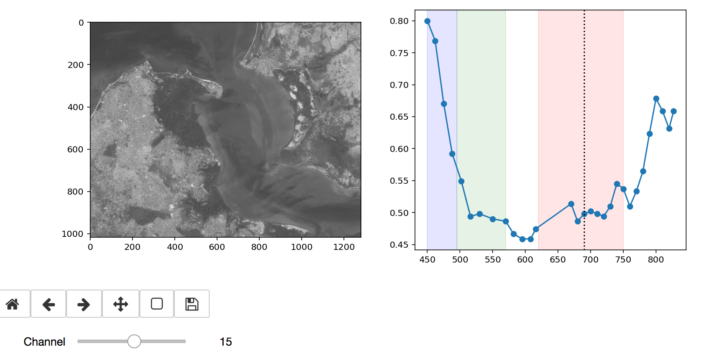

# Open Impact

This repository compiles several social and/or environmental impact projects.

Where available, we leverage open software (like python) and open data (like Landsat), as well as Satellogic open data (under the reproducible academic research program, see [license.md](license.md))


Each idea has an explanation at the top, how to read the data, and a few pointers of the tools you might need. This is not an exclusive list, if there's a similar idea wit the same data, feel free to work on it. These are just pointers to ignite your curiosity and get you up and running as quickly as possible.

## Install

We use conda so we can isolate, and replicate, the working environment across computers. We also use jupyter notebooks running python to explore the data.

To run this notebooks:
* [Install anaconda](https://conda.io/docs/installation.html)
* clone this repository
* Create an environment using the `environment.yml` on this root folder.
    ```sh
    conda env create -f environment.yml
    ```
* Activate the new "satellogic" conda environment.
    ```sh
    source activate satellogic
    ```

Troubleshoot:

If your jupyter runs a kernel that is not from the conda active environment you might need to run this to add it:
    jupyter python -m ipykernel install --user


## City fingerprint.

Can we create a measure that compares cities how the look from space? Could it be used to detect similar cities? Could it detect changes of population, if it's a green city, a brick and asphalt city, ...

Data:
- Geojson list of 200 cities around the world with metadata like population at several times.
- Landsat/Copernicus Level-1 at different times.
- Satellogic Hyperspectral where available.
- Historical Hyperion where available.

Concept:

- Cluster the hyperspectral data from many cities into K-means or other algorithms. Force historical data of the same city to be in the same cluster (emphasize permanent information) or in different clusters (emphasize sensitivity to changes in population or other factors).

- Use Open Street Map data to calculate the % content for each satellite pixel (e.g. A landsat pixel might cover 10% park, 20% road, ...). This can be used to predict OSM in unkown places, the pixels with most error might indicate new constructions or features.

[Notebook](#)


## Access to market / Gambia

One of the most important aspects in development is access to/from resources. For example access to  hospitals, to schools, to markets...

The idea of this project is to focus on measuring this accessibility, either by assessing the transportation road conditions (find new, missing roads, or pavement quality) or calculate the distance from the harvested fields to the ports or markets.

For example, in Gambia [1/3 of the GPD](https://en.wikipedia.org/wiki/Economy_of_the_Gambia) is agriculture, and about [75% of the population depends on crops](https://rainforests.mongabay.com/deforestation/archive/Gambia.htm).

We could, for example, calculate first the location of planted areas, and then the travel times between these and the closest villages, or port (for exports). This will give us information of the operating cost and effort to produce the harvest, and could help us calculate the impact when a particular road is upgraded, or degraded.

Data:
- Landsat/Copernicus Level-1 at different times.
- Satellogic Hyperspectral where available.
- Historical Hyperion where available.

[See Notebook for more details](gambia/Gambia.ipynb)



## Ocean color

This project explores using Satellogic hyperspectral camera for data over the Oceans. Hyperspectral measurements over water bodies can be used to infer important information such as phytoplankton biomass or concentrations of other living and non-living material that modify the characteristics of the incoming radiation.

In this example we show how to download, visualize and cluster hyper data over the coasts of Qatar, Luisiana (USA) and the Southern tip of South Korea.

[Notebook]("Ocean color/Ocean color.ipynb")
