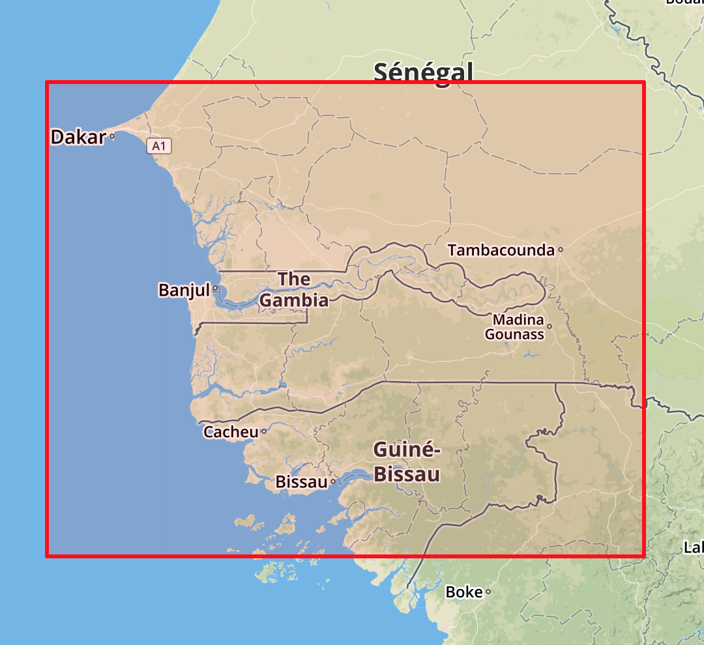
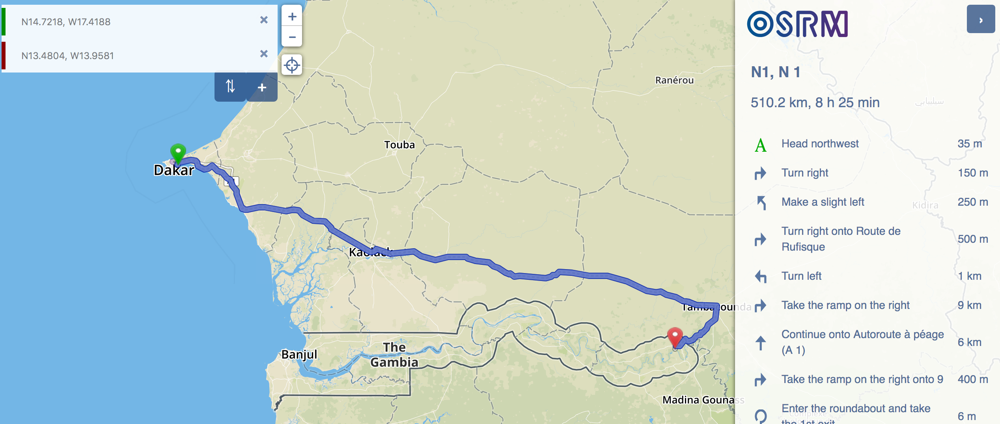

# Local Routing server

This document explain who to run a local server to give, much faster, travel times, in custom types of vehicles, on a custom region.

In this case we focus on a region around the Gambia, and a truck.

## Overview

0. Install software
1. Download and sync OSM data
2. Download and run routing engine OSRM.
3. Sample routing called

## 0. Install Sfotware.

You'll need:
* osmconvert `wget -O - http://m.m.i24.cc/osmconvert.c | cc -x c - -lz -O3 -o osmconvert`
* osmupdate `wget -O - http://m.m.i24.cc/osmupdate.c | cc -x c - -o osmupdate`
* gdal
* docker

## 1. Download and sync OSM data


Establish a Bounding box around The gambia. Add a generous buffer around it, since sometimes to go to you destination you might take a better road around the region.

[](https://gist.github.com/brunosan/b10932ecba1b792dc4ade0f4fb41c81b)

```sh
    wget https://gist.githubusercontent.com/brunosan/b10932ecba1b792dc4ade0f4fb41c81b/raw/7b4f530c186e79071225a8f862ffb65974d38e88/map.geojson
   ogrinfo map.geojson map | grep Extent
   BBOX="-17.995605,11.243062,-12.963867,15.135764"

   #Download the latest OSM data:
   DATE=`date '+%Y-%m-%d'`
   mkdir data/
   cd data/
   wget -P data/ -O gambia_$DATE.osm "http://overpass.osm.rambler.ru/cgi/xapi_meta?*[bbox=$BBOX]"
   #]*
```

* OPTIONAL, Convert to 05m file format (MUCH smaller)
```sh
../osmconvert -v gambia_$DATE.osm -o=gambia_$DATE.o5m
```

* OPTIONAL, If you want to merge updates from OSM
```sh
../osmupdate -v gambia_$DATE.o5m gambia_$DATE_tmp.o5m -b=$BBOX
```

## 2. Download and run routing engine OSRM.

Follow instructions on [OSRM](https://github.com/Project-OSRM/osrm-backend)

You should also define the driving properties of the vehicle (top speed, types of roads in can travel, ...). I created a quick `truck.lua` based on the standard `car.lua` and lowering the top speed.

```sh
docker run -t -v $(pwd):/data osrm/osrm-backend osrm-extract -p /data/truck.lua /data/gambia_2018-02-20.osm

docker run -t -v $(pwd):/data osrm/osrm-backend osrm-partition /data/gambia_2018-02-20.osrm

docker run -t -v $(pwd):/data osrm/osrm-backend osrm-customize /data/gambia_2018-02-20.osrm

#run the server locally
docker run -t -i -p 5000:5000 -v $(pwd):/data osrm/osrm-backend osrm-routed --algorithm mld /data/gambia_2018-02-20.osrm
```

OPTIONAL, run a front-end to check the results, on http://127.0.0.1:9966
```sh
docker run -p 9966:9966 osrm/osrm-frontend
```

[](http://localhost:9966/?z=8&center=14.048666%2C-15.188599&loc=14.721761%2C-17.418823&loc=13.480448%2C-13.958130&hl=en&alt=0)


## 3. Sample routing called

* To get the time and distance from a origin-destination point:

```python
import requests  #http framework to make Mapbox API requests for routes
import json # handle response as json
import datetime # save timestamp

url="http://localhost:5000/route/v1/driving/"
comma="%2C"
sep="%3B"
origin=[14.721761,-17.418823]
destination=[13.480448,-13.958130]
fullurl=url+str(origin[1])+','+str(origin[0])+";"+str(destination[1])+','+str(destination[0])
response = requests.get(fullurl) #do the request
response.raise_for_status() # ensure we notice bad responses
print, fullurl
# http://localhost:5000/route/v1/driving/-17.418823,14.721761;-13.95813,13.480448'
print, json.loads(response.text)['routes'][0]['distance']," meters"
# 510247, ' meters'
print, json.loads(response.text)['routes'][0]['duration']," seconds"
# 0281.4, ' seconds'
```

* Given an array of origins, and an array of destinations, get ALL distances and times:

```python
TODO
import csv
import requests
import json
import numpy as np

#calculate all pairs of distance
#print [time,distance] in [hours,km] to get for one point to the other
url="http://localhost:5000/route/v1/driving/"
pairs={}
print("Prefetching all pairs of time distances: %i items"%((len(clusters)*(len(clusters)))/2))
batch=100

def dispatch(origin_loc,origin_id,destinations_locs,pair_ids):
    print("Requesting %3i pairs. Number of pairs done %i"%(len(pair_ids)+1,len(pairs)),end="\r")
    url=url+origin_loc+destinations_locs[:-1]
    response = requests.get(url) #do the request
    response_j=json.loads(response.text)
    times=response_j['durations'][0]
    pair_ids=[origin_id+'-'+origin_id]+pair_ids
    #print(len(times),len(pair_ids))
    for x in np.arange(len(times))[1:]:
        pairs[pair_ids[x]]=float(times[x])

 for index_i,c_i in clusters.iterrows():   
    origin_id=c_i['IDCLUSTER']
    origin_loc=str(c_i['flng'])+','+str(c_i['flat'])+";"
    destinations_locs=""
    pair_ids=[]
    for index_j,c_j in clusters.iterrows():
        destination_id=c_j['IDCLUSTER']
        pair=origin_id+'-'+destination_id
        pair_reverse=destination_id+'-'+origin_id
        if any(x in list(pairs.keys()) for x in [pair,pair_reverse]):
            print("",end="")
        else:
            destinations_locs+=str(c_j['flng'])+','+str(c_j['flat'])+";"
            pair_ids.append(pair)
        if len(pair_ids)==batch-1:
            #print("batch full")
            dispatch(origin_loc,origin_id,destinations_locs,pair_ids)
            destinations_locs=""
            pair_ids=[]
    #print("end of destinations",len(pair_ids))
    if len(pair_ids)>0:
        dispatch(origin_loc,origin_id,destinations_locs,pair_ids)
 print("\nDone")

```
